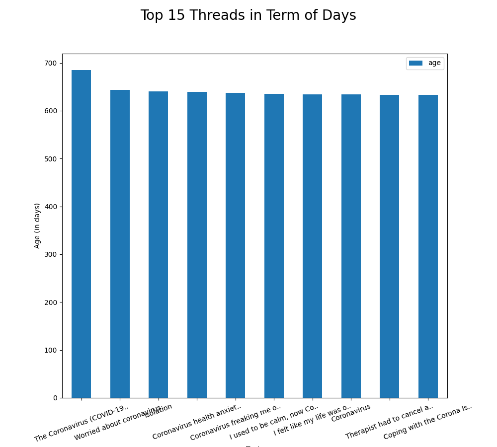

Data Scraping on Forums Website
==============================
This is a submission of **assignment 2** for the **CIS711** course.

It contains the code necessary to scrape data from a selected forum website.

This repository is merely a demonstration of how web scraping performs.

Getting Started
------------
Clone the project from GitHub

`$ git clone https://github.com/tariqshaban/forum-data-scraper.git`

Install numpy
`pip install numpy`

Install pandas
`pip install pandas`

install matplotlib
`pip install matplotlib`

install seaborn
`pip install seaborn`

Install calplot
`pip install calplot`

Install cloudscraper
`pip install cloudscraper`

Install beautiful soup
`pip install bs4`

You may need to configure the Python interpreter (depending on the used IDE)

No further configuration is required.

Project Structure
------------

    ├── README.md                   <- The top-level README for developers using this project.
    │
    ├── helpers
    │   ├── date_time_handler       <- Set of static methods that aid some time manipulations.
    │   └── progress_handler        <- Set of static methods that aid some progress manipulations.
    │
    ├── images                      <- Storing readme image files.
    │   
    ├── providers
    │   ├── plots_provider          <- Static methods which perform the plotting functionality.
    │   └── forum_scraper           <- Static methods which perform the scraping functionality.
    │
    ├── cached_threads.csv          <- Storing cached threads from a previous state.
    │
    ├── cached_threads_details.csv  <- Storing cached thread's details from a previous state.
    │   
    └── main                        <- Acts as a sandbox for methods invocation.

Report / Findings
------------

### What tools have been used to scrape data off the web?

Beautiful Soup has been used for scraping; it contains abstract out-of-the-box methods that help extract information
from the HTML file.

> Beautiful Soup is a Python library for pulling
> data out of HTML and XML files. It works with your
> favorite parser to provide idiomatic ways of navigating,
> searching, and modifying the parse tree.
> It commonly saves programmers hours or days of work.

There were no modifications committed for this scraping tool since it already satisfies the required objectives.

We used cloudscraper instead of the well-known requests since the website is protected under Cloudflare bot spam
detection, a normal HTTP request would not suffice (returns forbidden 403 status code)

### What were the target websites?

Primarily [Mental Health Forum](https://www.mentalhealthforum.net/),
[covid-19-mental-health](https://www.mentalhealthforum.net/forum/forums/coronavirus-covid-19-mental-health.394/)
sub-forum

### What information did you extract?

We successfully collected information of the following:

* Thread
    * Thread ID
    * Poster ID
    * Poster Name
    * Poster Image
    * Last Replier ID
    * Last Replier Name
    * Last Replier Image
    * Last Replier Date
    * Date Posted
    * Title
    * Status
        * IsLocked :lock:
        * Is Sticky :pushpin:
    * Replies
    * Views
* Thread's Details
    * Thread ID
    * User ID
    * User Name
    * User Image
    * User Title
    * User Banners
    * User Join Date
    * User Total Sent Messages
    * User Location
    * Reactions
        * Like :thumbsup:
        * Thanks :grinning:
        * Hug :hugs:
    * User Post Date
    * User Post

### What manipulations have you made for the data?

* Thread
    * Column datatype conversion
    * Replaced blank spaces/empty values with nulls
* Thread's Details
    * Column datatype conversion
    * Replaced blank spaces/empty values with nulls

### What illustrations have you made?

  
Threads Illustrations

>From `cached_threads.csv` in timestamp `2021-12-07 16:50:02.658498`

> 
Notice that there are many posts activity in March, just when the [World Health Organization (WHO)
declared covid 19 virus as a pandemic](https://en.wikipedia.org/wiki/Severe_acute_respiratory_syndrome_coronavirus_2#:~:text=The%20World%20Health%20Organization%20declared,on%2011%20March%202020.)
(11 March 2020).

> 

***The Coronavirus (COVID-19) thread - Spreading all around the world*** thread received
a total of 902 replies and approximately 18000 views. **However**, this is a misleading plot since it shows views
and replies location based on the **thread's posting date**.

> 
This figure indicates that there is a strong positive correlation between views and replies.

> 
Notice that **Natalie** is the most active member in this sub-forum, she has a banner of *Well-known member*.

> 
The thread ***The Coronavirus (COVID-19) thread - Spreading all around the world***
is the oldest thread (posted in 2020-01-26).

> 
There is an insignificant chance for a thread to become either locked or sticky.
 

 

  
Thread's Details Illustrations

>From `cached_threads_details.csv` in timestamp `2021-12-07 17:15:54.109998`

> 
The forum has been most active during March and April (regarding the replies).

> 
The highest replier in the sub-forum is, *unsurprisingly*, **Natalie**; there was a good
indication for Natalie to become one of the highest repliers since she is the highest threads poster.

> 
This figure illustrates the number of messages each user sent for **ALL** sub-threads.

> 
Showing the types of titles each user might have.

> 
Showing the types of banners each user might have, banners seem to indicate the role of such a user.

> 
The number of users increased exponentially when covid 19 broke out, you may notice from previous figures that there 
have been posts from only the beginning of 2020, this perhaps indicates that the sub-forum has been cleared during that
time.

> 
Notice that 41% of users are from England, the pie chart also contains ***"."*** as a country since there are no 
restrictions in country names.

--------